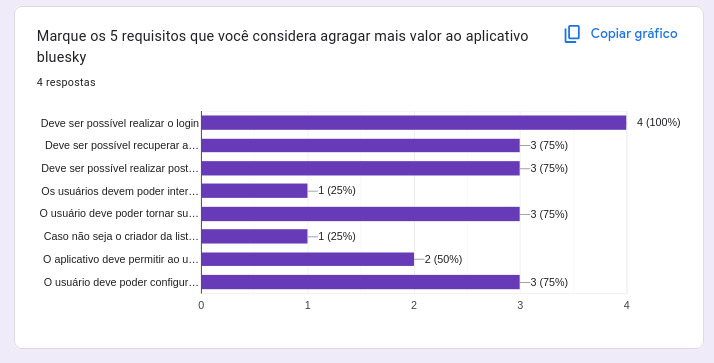

## Introdução

A priorização envolve distribuir recursos limitados para obter o melhor retorno possível, e a técnica do $100 utiliza uma abordagem baseada em alocação fictícia de dinheiro para ajudar a determinar a importância relativa dos requisitos. Nesse contexto, priorizou-se exclusivamente os requisitos funcionais, visando simplificar o processo de decisão para o usuário.

## Metodologia
Para aplicar a técnica $100 e priorizar os requisitos do sistema, foram realizadas duas entrevistas estruturadas com o usuário selecionado. Cada entrevista teve como objetivo avaliar uma categoria específica de requisitos: funcionais e não funcionais. Para realizar as entrevistas foi considerado que o entrevistado pudesse escolher um número entre 2 a 20 para classificar os requisitos, sendo 20 os mais relevantes ao seu ponto de vista e 2 os menos.

Na primeira entrevista, a abordagem foi a mesma, mas o foco foi nos requisitos não funcionais, como desempenho, segurança, usabilidade e confiabilidade. O participante novamente alocou $100 entre os requisitos dessa categoria, permitindo identificar quais aspectos não funcionais são considerados mais críticos para a satisfação e a utilização eficaz do sistema.

Na segunda entrevista, o foco foi nos requisitos funcionais, buscando identificar as funcionalidades mais importantes para o usuário. O participante recebeu um total fictício de $100, que deveria ser distribuído entre os requisitos apresentados com base na sua relevância e impacto para a experiência no aplicativo. Essa etapa permitiu uma análise quantitativa da percepção do usuário em relação às prioridades funcionais.

Ambas as entrevistas seguiram um formato estruturado, com explicações claras sobre os requisitos e tempo suficiente para o participante refletir antes de tomar suas decisões. Ao final de cada sessão, os valores alocados foram somados e analisados para determinar as prioridades gerais dentro de cada categoria. Essa metodologia garantiu um entendimento claro e fundamentado sobre as necessidades do usuário, facilitando a tomada de decisões na etapa de desenvolvimento.

## Entrvista 1
### Participante

O usuário selecionado foi escolhido por sua experiência com o aplicativo Bluesky. Assim, esse participante possui conhecimento prático sobre as informações que os usuários buscam ao utilizar o aplicativo. A lista de participantes se encontra na tabela 1.

    
<b>Tabela 1:</b> Paticipantes da Entrevista 1

    <table border="1">
    <thead>
        <tr>
        <th>Nome</th>
        <th>Função</th>
        </tr>
    </thead>
    <tbody>
        <tr>
            <td>Eduarda Tavares</td>
            <td>Mediador</td>
        </tr>
        <tr>
            <td>Ana Carolina</td>
            <td>Usuária</td>
        </tr>
    </tbody>
    </table>
    
<b>Autor:</b> Eduarda Tavares

<a href='https://youtu.be/ZEWQwIit78I'>Link para a entrevista.</a>

### Preço Requisitos Não Funcionais

Abaixo na tabela 2, temos o resultado do preço de cada requisito não funcional.

<b>Tabela 2:</b> Preço requisitos não funcionais

<table border="1">
  <thead>
    <tr>
      <th>Tipo</th>
      <th>Descrição</th>
      <th>ID</th>
      <th>Preço Usuário</th>
      <th>Preço Mediador</th>
      <th>Preço Final</th>
    </tr>
  </thead>
  <tbody>
    <tr>
      <td>RNF1</td>
      <td>Deve ser possível personalizar o aplicativo (dark mode, idiomas…)</td>
      <td>OB11</td>
      <td>$5</td>
      <td>$15</td>
      <td>$10</td>
    </tr>
    <tr>
      <td>RNF2</td>
      <td>O sistema deve processar buscas e carregar feeds personalizados rapidamente, mesmo com grandes volumes de dados, garantindo uma experiência fluida para o usuário.</td>
      <td>NIS1 BT7</td>
      <td>$20</td>
      <td>$10</td>
      <td>$15</td>
    </tr>
    <tr>
      <td>RNF3</td>
      <td>O sistema deve ser capaz de crescer e suportar um número crescente de usuários e posts sem comprometer o desempenho.</td>
      <td>NIS2, NIS13 e BT7</td>
      <td>$10</td>
      <td>$20</td>
      <td>$15</td>
    </tr>
    <tr>
      <td>RNF4</td>
      <td>Todos os dados sensíveis, como informações de login e reviews salvas, devem ser protegidos por criptografia. O sistema deve implementar autenticação segura e proteger contra ataques como SQL injection e XSS.</td>
      <td>NIS3</td>
      <td>$20</td>
      <td>$20</td>
      <td>$20</td>
    </tr>
    <tr>
      <td>RNF5</td>
      <td>A interface do usuário deve ser intuitiva e fácil de usar, com opções bem definidas para buscar, salvar e visualizar postagens. O design deve ser centrado no usuário e acessível a diferentes perfis de idade.</td>
      <td>NIS4</td>
      <td>$5</td>
      <td>$12</td>
      <td>$8.5</td>
    </tr>
    <tr>
      <td>RNF6</td>
      <td>O sistema deve ter alta disponibilidade, operando continuamente com mínimas interrupções e implementando redundância de servidores para garantir estabilidade.</td>
      <td>NIS5</td>
      <td>$5</td>
      <td>$5</td>
      <td>$5</td>
    </tr>
    <tr>
      <td>RNF7</td>
      <td>O sistema deve ser compatível com dispositivos móveis modernos, oferecendo uma interface responsiva e acessível em diferentes tamanhos de tela.</td>
      <td>NIS6 e BT9</td>
      <td>$12</td>
      <td>$4</td>
      <td>$8</td>
    </tr>
    <tr>
      <td>RNF8</td>
      <td>O sistema deve permitir que o usuário personalize seus feeds e notificações facilmente, com opções para ajustar preferências de conteúdo e formato.</td>
      <td>NIS7</td>
      <td>$5</td>
      <td>$2</td>
      <td>$3.5</td>
    </tr>
    <tr>
      <td>RNF9</td>
      <td>O sistema deve garantir a privacidade do usuário, permitindo que ele controle quem pode ver suas atividades e reviews, com políticas claras sobre coleta e uso de dados.</td>
      <td>NIS8</td>
      <td>$20</td>
      <td>$18</td>
      <td>$19</td>
    </tr>
    <tr>
      <td>RNF10</td>
      <td>O aplicativo deve ter um tempo de resposta para cada ação menor que 3 segundos.</td>
      <td>NIS9</td>
      <td>$8</td>
      <td>$10</td>
      <td>$9</td>
    </tr>
    <tr>
      <td>RNF11</td>
      <td>O aplicativo deve ter interface intuitiva para usuários frequentes de redes sociais, levando até 15 minutos para que se familiarizem com feeds, listas.</td>
      <td>NIS10, BT10</td>
      <td>$2</td>
      <td>$7</td>
      <td>$4.5</td>
    </tr>
    <tr>
      <td>RNF12</td>
      <td>O aplicativo deve prover ambientes saudáveis aos seus usuários, os protegendo de conteúdos nocivos.</td>
      <td>NIS11</td>
      <td>$15</td>
      <td>$2</td>
      <td>$8.5</td>
    </tr>
    <tr>
      <td>RNF13</td>
      <td>O aplicativo deve ser transparente quanto ao uso dos dados de seus usuários, independente de onde se encontra, o usuário deve estar a menos de 5 cliques dos Termos de Serviço e Política de Privacidade.</td>
      <td>NIS12</td>
      <td>$20</td>
      <td>$8</td>
      <td>$14</td>
    </tr>
    <tr>
      <td>RNF14</td>
      <td>O aplicativo deve indicar ao usuário quando uma ação não pode ser concluída e o motivo para isso.</td>
      <td>NIS14</td>
      <td>$7</td>
      <td>$15</td>
      <td>$11</td>
    </tr>
    <tr>
      <td>RNF15</td>
      <td>O aplicativo deve ter uma aparência agradável ao usuário.</td>
      <td>QT6</td>
      <td>$3</td>
      <td>$11</td>
      <td>$7</td>
    </tr>
    <tr>
      <td>RNF16</td>
      <td>A plataforma deve garantir transparência nos algoritmos de recomendação.</td>
      <td>QT6</td>
      <td>$8</td>
      <td>$3</td>
      <td>$5.5</td>
    </tr>
    <tr>
      <td>RNF17</td>
      <td>O sistema deve proteger os dados dos usuários de acordo com a LGPD.</td>
      <td>BT8</td>
      <td>$20</td>
      <td>$20</td>
      <td>$20</td>
    </tr>
  </tbody>
</table>

<b>Autor:</b> <a href="https://github.com/erteduarda">Eduarda Tavares</a>
 

### Prioridade Final dos Requisitos Não Funcionais

Na tabela 3 abaixo, temos a prioridade final dos requisitos não funcionais escolhidos como principais.

<b>Tabela 3:</b> Prioridade requisitos não funcionais

<table border="1">
  <thead>
    <tr>
      <th>Tipo</th>
      <th>Descrição</th>
      <th>ID</th>
      <th>Prioridade</th>
    </tr>
  </thead>
  <tbody>
    <tr>
      <td>RNF4</td>
      <td>Todos os dados sensíveis, como informações de login e reviews salvas, devem ser protegidos por criptografia. O sistema deve implementar autenticação segura e proteger contra ataques como SQL injection e XSS.</td>
      <td>NIS3</td>
      <td>1º</td>
    </tr>
    <tr>
      <td>RNF17</td>
      <td>O sistema deve proteger os dados dos usuários de acordo com a LGPD.</td>
      <td>BT8</td>
      <td>2º</td>
    </tr>
    <tr>
      <td>RNF9</td>
      <td>O sistema deve garantir a privacidade do usuário, permitindo que ele controle quem pode ver suas atividades e reviews, com políticas claras sobre coleta e uso de dados.</td>
      <td>NIS8</td>
      <td>3º</td>
    </tr>
    <tr>
      <td>RNF2</td>
      <td>O sistema deve processar buscas e carregar feeds personalizados rapidamente, mesmo com grandes volumes de dados, garantindo uma experiência fluida para o usuário.</td>
      <td>NIS1 BT7</td>
      <td>4º</td>
    </tr>
    <tr>
      <td>RNF3</td>
      <td>O sistema deve ser capaz de crescer e suportar um número crescente de usuários e posts sem comprometer o desempenho.</td>
      <td>NIS2, NIS13 e BT7</td>
      <td>5º</td>
    </tr>
    <tr>
      <td>RNF14</td>
      <td>O aplicativo deve indicar ao usuário quando uma ação não pode ser concluída e o motivo para isso.</td>
      <td>NIS14</td>
      <td>6º</td>
    </tr>
  </tbody>
</table>

<b>Autor:</b> <a href="https://github.com/erteduarda">Eduarda Tavares</a>
 

## Entrevista 2
### Participante

O usuário selecionado foi escolhido por sua experiência com o aplicativo Bluesky. Assim, esse participante possui conhecimento prático sobre as informações que os usuários buscam ao utilizar o aplicativo. A lista de participantes se encontra na tabela 4.

    
<b>Tabela 4:</b> Paticipantes da Entrevista 2

    <table border="1">
    <thead>
        <tr>
        <th>Nome</th>
        <th>Função</th>
        </tr>
    </thead>
    <tbody>
        <tr>
            <td>Carla Clementino</td>
            <td>Mediador</td>
        </tr>
        <tr>
            <td>Bruna Araujo</td>
            <td>Usuária</td>
        </tr>
    </tbody>
    </table>
    
<b>Autor:</b> Carla Clementino

<a href='https://youtu.be/9uNIQFSqgM8'>Link para a entrevista.</a>

### Preço Requisitos Funcionais

<b>Tabela 5:</b> Prioridade requisitos funcionais

| **Tipo** |                                                                                            **Descrição**                                                                                            |      **ID**      | **Preço Usuário** | **Preço Mediador** | **Preço Final** |
| :------: | :-------------------------------------------------------------------------------------------------------------------------------------------------------------------------------------------------: | :--------------: | :---------------: | :----------------: | :-------------: |
|   RF1    |                                                                                 Deve ser possível realizar o login                                                                                  | OB1 e IS1 e IS10 |        20         |         20         |       20        |
|   RF2    |                                                                          Deve ser possível recuperar a senha no aplicativo                                                                          |       OB2        |        20         |         20         |       20        |
|   RF3    |                                                                 Deve ser possível acessar novos conteúdos rapidamente na plataforma                                                                 |       OB3        |        15         |         15         |       15        |
|   RF4    |                                                                         Deve ser possível realizar postagens na plataforma                                                                          |       OB4        |        20         |         20         |       20        |
|   RF5    |                                                                  Deve ser possível ao usuário editar suas publicações já postadas                                                                   |    OB5 e IS17    |         5         |         2          |        4        |
|   RF6    |                         O sistema deve permitir que o usuário faça buscas por posts relacionados ao seu interesse, usando palavras-chave, hashtags ou filtros específicos.                          |    OB6 e IS2     |        15         |         15         |       15        |
|   RF7    |                                                                             Deve ser possível favoritar uma comunidade                                                                              |       OB7        |        10         |         5          |        8        |
|   RF8    |                                          O usuário deve poder criar seus próprios posts e compartilhá-los com um feed específico ou a comunidade em geral.                                          |    OB8 e IS6     |        10         |         20         |       15        |
|   RF9    |                                                                       Deve ser possível ver as mensagens com outros usuários                                                                        |       OB9        |        12         |         10         |       11        |
|   RF10   |                                                                            Deve ser possível editar o conteúdo do perfil                                                                            |   OB10 e IS12    |        20         |         15         |       18        |
|   RF11   |                                          O sistema deve notificar o usuário sobre novos posts com base nos interesses e feeds personalizados configurados.                                          |  OB12, IS7, BT3  |         3         |         10         |        7        |
|   RF12   |                                                     O usuário deve poder salvar Posts de interesse em uma seção dedicada para consulta futura.                                                      |    IS3 e IS22    |        18         |         2          |       10        |
|   RF13   |                     O sistema deve disponibilizar uma seção onde o usuário possa visualizar e gerenciar todos os posts salvos, com opções de ordenação por data, e/ou hashtag.                      |       IS4        |        15         |         2          |        9        |
|   RF14   |       O sistema deve permitir que o usuário crie ou use feeds (micro fóruns de posts) de terceiros personalizados com base em critérios como tipo de post, usuários ou hashtags relacionadas.       |       IS5        |        10         |         2          |        6        |
|   RF15   |                                                   Os usuários devem poder interagir com postagens por meio de comentários, curtidas e respostas.                                                    | IS8 e IS16 e QT2 |        20         |         20         |       20        |
|   RF16   |                       O sistema deve permitir a aplicação de filtros avançados, como autor do post, data de publicação ou popularidade, para melhorar a experiência de busca.                       |       IS9        |         7         |         10         |        9        |
|   RF17   |                                                           O usuário deve ser capaz de fazer login/logout automático em sua conta criada.                                                            |       IS11       |        20         |         2          |       11        |
|   RF18   |                                                             O usuário deve poder fixar uma publicação em seu perfil, dando-a destaque.                                                              |       IS13       |         4         |         2          |        3        |
|   RF19   |                O usuário deve poder tornar sua conta privada, restringindo a interação de outros usuários ao permitir que apenas seguidores consigam interagir diretamente com ele.                 |       IS14       |        20         |         20         |       20        |
|   RF20   |                                                          Deve ser possível ao usuário fazer publicações contendo texto, imagens e vídeos.                                                           |       IS15       |        20         |         12         |       18        |
|   RF21   |                      Deve ser possível ao usuário visualizar dentro do aplicativo publicações de diferentes idiomas traduzidas para o idioma principal definido no aplicativo.                      |       IS18       |        20         |         10         |       15        |
|   RF22   |                                                      O usuário deve poder mandar mensagens diretas a outro usuário, caso se sigam mutuamente.                                                       |       IS19       |        20         |         16         |       18        |
|   RF23   |                                                       O usuário deve poder criar, ingressar, convidar e sair de grupos de mensagens diretas.                                                        |       IS20       |        11         |         2          |        7        |
|   RF24   |                                                           O usuário deve poder mandar mídias como vídeos e áudios nas mensagens privadas.                                                           |       IS21       |        13         |         10         |       12        |
|   RF25   |                                                         O usuário deve poder criar, modificar e excluir suas listas de perfis de interesse.                                                         |       IS23       |        18         |         15         |       17        |
|   RF26   | Caso não seja o criador da lista, o usuário deve poder inscrever-se/deixar de ser inscrito em listas de perfis de interesse para ter/deixar de ter acesso às publicações desses perfis por uma aba. |       IS24       |        20         |         20         |       20        |
|   RF27   |                                                              O usuário deve poder criar, modificar e excluir suas listas de moderação.                                                              |       IS25       |        10         |         2          |        6        |
|   RF28   |      Caso não seja o criador da lista, o usuário deve poder inscrever-se/deixar de ser inscrito em listas de moderação para não permitir/permitir a interação com os perfis contidos na lista.      |       IS26       |        18         |         20         |       19        |
|   RF29   |                                                    O usuário deve poder visualizar a quantidade de vezes em que sua publicação foi visualizada.                                                     |       IS27       |         2         |         2          |        2        |
|   RF30   |                                                   O aplicativo deve permitir ao usuário a comunicação, entretenimento e informações atualizadas.                                                    |       QT1        |        20         |         20         |       20        |
|   RF31   |                                                         O aplicativo deve permitir linkar para outras pessoas sem o sufixo ".bsky.social".                                                          |       QT3        |        20         |         2          |       11        |
|   RF32   |                                                                             O aplicativo deve permitir Trending Topics.                                                                             |       QT5        |        17         |         18         |       18        |
|   RF33   |                                                                     O aplicativo deve permitir o sistema de tags fora do post.                                                                      |       QT4        |         2         |         2          |        2        |
|   RF34   |                                                                     O usuário deve poder criar comunidades ou grupos privados.                                                                      |       BT1        |         4         |         2          |        3        |
|   RF35   |                                                                    O usuário deve poder configurar a privacidade das postagens.                                                                     |       BT2        |        20         |         20         |       20        |
|   RF36   |                                                                   O sistema deve enviar notificações sobre eventos em tempo real.                                                                   |       BT4        |        10         |         10         |       10        |
|   RF37   |                                                              O usuário deve poder acessar métricas sobre o alcance de suas postagens.                                                               |       BT5        |        14         |         8          |       11        |

<b>Autor:</b> <a href="https://github.com/ccarlaa">Carla Clementino</a>
 

### Prioridade Final dos Requisitos Funcionais

Como é possível ver na tabela 4 acima, ocorreu empate entre alguns requisitos. Em decorrência disso, foi feito uma votação interna para elicitar quais requisitos agregam ou agregariam mais valor a plataforma. O resultado pode ser visto abaixo: 

<b>Imagem 1:</b>Pesquisa para desempate de requisitos funcionais.

<figure markdown="span">
  
  <figcaption><b>Autor:</b> <a href="https://github.com/ccarlaa">Carla Clementino</a></figcaption>
</figure>

<b>Tabela 6: </b>Prioridade Final dos Requisitos Funcionais

| **Tipo** |                                                                            **Descrição**                                                                             |      **ID**      |
| :------: | :------------------------------------------------------------------------------------------------------------------------------------------------------------------: | :--------------: |
|   RF1    |                                                                  Deve ser possível realizar o login                                                                  | OB1 e IS1 e IS10 |
|   RF2    |                                                          Deve ser possível recuperar a senha no aplicativo                                                           |       OB2        |
|   RF4    |                                                          Deve ser possível realizar postagens na plataforma                                                          |       OB4        |
|   RF19   | O usuário deve poder tornar sua conta privada, restringindo a interação de outros usuários ao permitir que apenas seguidores consigam interagir diretamente com ele. |       IS14       |
|   RF35   |                                                     O usuário deve poder configurar a privacidade das postagens.                                                     |       BT2        |

<b>Autor:</b> <a href="https://github.com/ccarlaa">Carla Clementino</a>
 

## Bibliografia

> 1. Bilheteria Digital. Bilheteria Digital, 2023. Disponível em: https://requisitos-de-software.github.io/2023.1-BilheteriaDigital/. Acesso em: 17, nov. 2024.

## :round_pushpin: Histórico de Versão 

    <table style="margin: auto;">
        <tr>
            <th>Data</th>
            <th>Data de Revisão</th>
            <th>Versão</th>
            <th>Descrição</th>
            <th>Autor</th>
            <th>Revisor</th>
        </tr>
        <tr>
            <td>24/11/2024</td>
            <td>24/11/2024</td>
            <td>1.0</td>
            <td>Adicionando página $100.</td>
            <td><a href="https://github.com/erteduarda">Eduarda Tavares</a></td>
            <td>Carla Clementino</td>
        </tr>
                <tr>
            <td>24/11/2024</td>
            <td>24/11/2024</td>
            <td>1.1</td>
            <td>Adicionando entrevista 2 do $100.</td>
            <td><a href="https://github.com/ccarlaa">Carla Clementino</a></td>
            <td><a href="https://github.com/Jao0V">João Ribeiro</a></td>
        </tr>
    </table>

