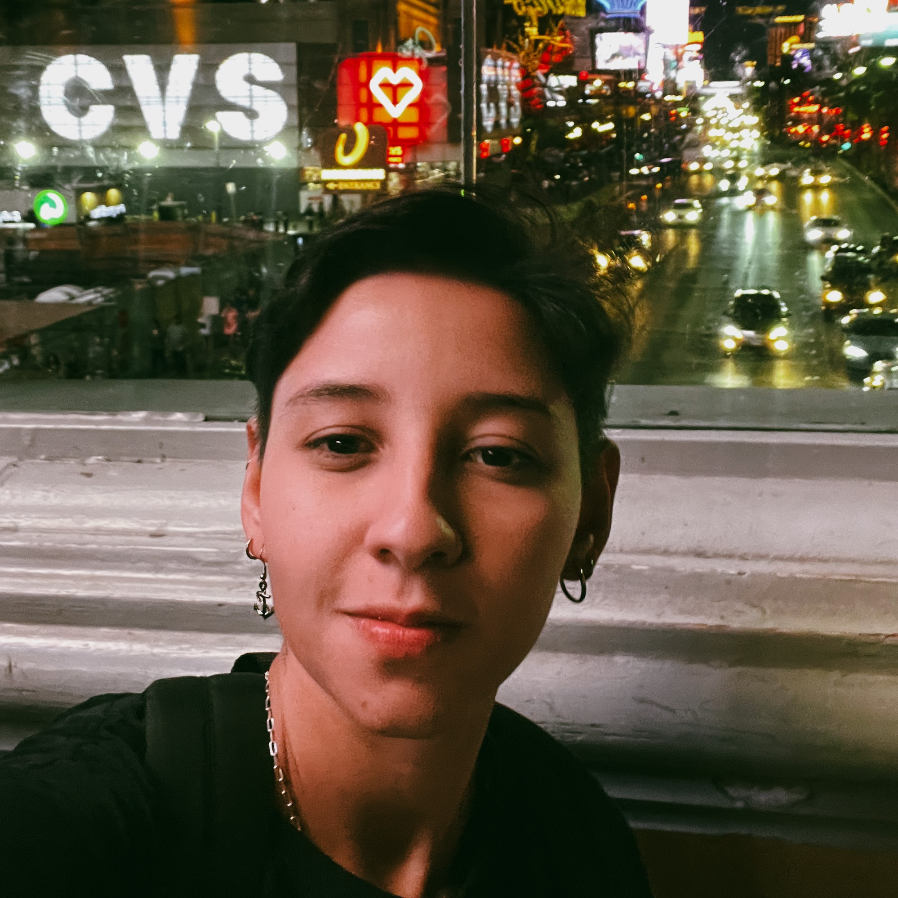
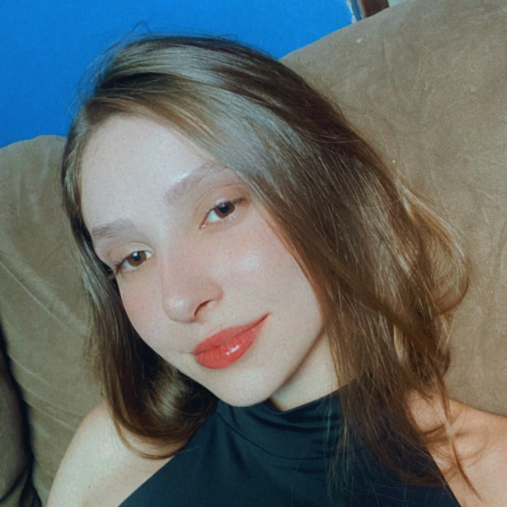

# :mag_right: Grupo 1 - Requisitos de Software

<!-- 

    Logo do nosso app

 -->

## :round_pushpin: Sobre o projeto:

Esta página reúne os artefatos produzidos ao longo da disciplina de Requisitos de Software na Universidade de Brasília (UnB) durante o segundo semestre de 2024.2. O projeto do grupo teve como foco principal a análise dos requisitos funcionais e não funcionais do aplicativo Bluesky, disponível para dispositivos mobile.

<figure>
    
</figure>

<!-- 
## :round_pushpin: Nome do app
Link do site:  -->

<!-- ## :round_pushpin: Direitos autorais e licença -->

## :round_pushpin: Equipe do projeto:
Os integrantes que compõem o grupo 1 estão presentes na Tabela 1.

    <table>
    <tr>
        <th>Foto</th>
        <th>Nome</th>
        <th>Email</th>
        <th>GitHub</th>
    </tr>
    <tr>
        <td></td>
        <td>Carla A. C. Ribeiro</td>
        <td>carlacarlaclementino@gmail.com</td>
        <td><a href="https://github.com/ccarlaa">@ccarlaa</a></td>
    </tr>
    <tr>
        <td></td>
        <td>Eduarda Rodrigues Tavares</td>
        <td>erteduarda@gmail.com</td>
        <td><a href="https://github.com/erteduarda">@erteduarda</a></td>
    </tr>
    <tr>
        <td></td>
        <td>Davi dos Santos Brito Nobre</td>
        <td>davinobre.ik@gmail.com</td>
        <td><a href="https://github.com/Jagaima">@Jagaima</a></td>
    </tr>
    <tr>
        <td></td>
        <td>João Vitor Lopes Ribeiro</td>
        <td>joao.vitortnt5@gmail.com</td>
        <td><a href="https://github.com/Joa0V">@Joa0V</a></td>
    </tr>
    <tr>
        <td></td>
        <td>Renata Quadros Kurzawa</td>
        <td>rekurzawa28@gmail.com</td>
        <td><a href="https://github.com/Renatinha28">@Renatinha28</a></td>
    </tr>
    </table>
    
Tabela 1: Integrantes do Grupo 1 (Fonte: autores, 2024)

## :round_pushpin: Histórico de Versão 

    <table style="margin: auto;">
        <tr>
            <th>Data</th>
            <th>Data de Revisão</th>
            <th>Versão</th>
            <th>Descrição</th>
            <th>Autor</th>
            <th>Revisor</th>
        </tr>
        <tr>
            <td>22/10/2024</td>
            <td>27/10/2024</td>
            <td>1.0</td>
            <td>Criação inicial</td>
            <td><a href="https://github.com/ccarlaa">Carla</a></td>
            <td><a href="https://github.com/Renatinha28">Renata Quadros</a></td>
        </tr>
    </table>

